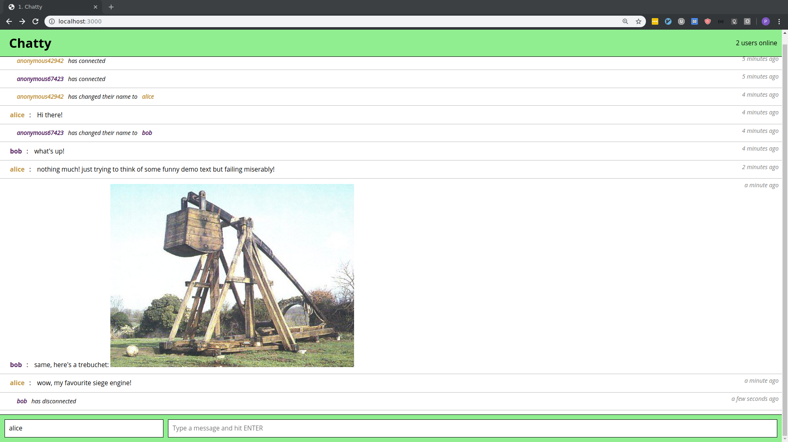

# Chatty
Real time web chatroom built using React, NodeJS, and websockets.

## Screenshot


Not terribly pretty, but functional!

## Dependencies

```
node >=12
```

## Setup

```
git clone https://github.com/grey275/Chatty
cd Chatty
npm install
npm start
```
Navigate to localhost:3000 and enjoy!